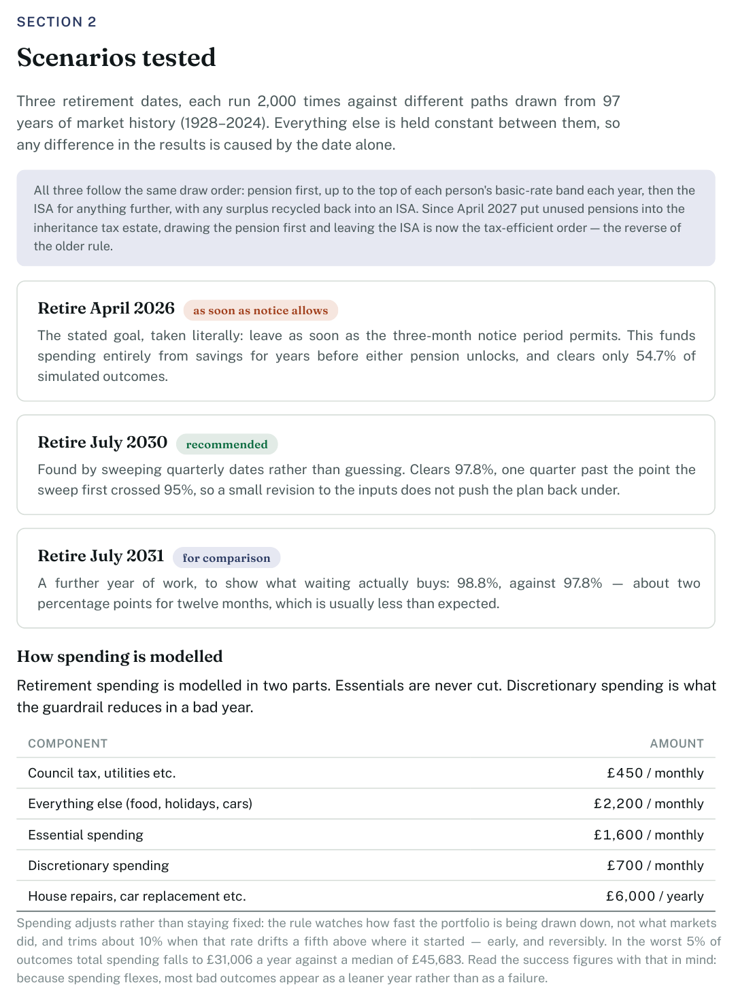
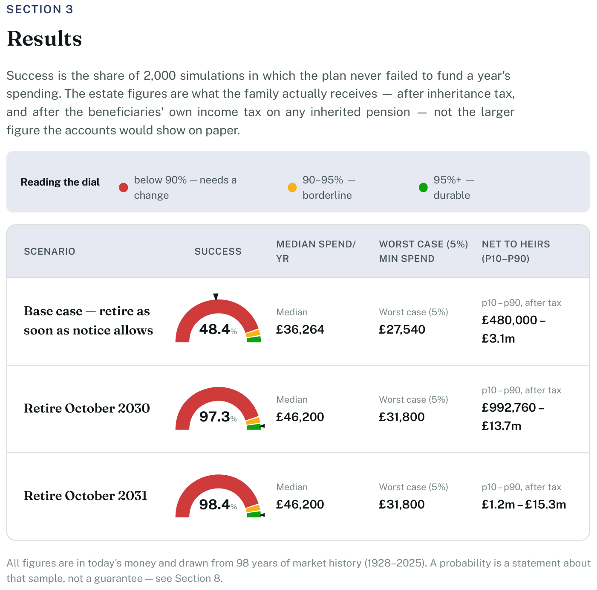
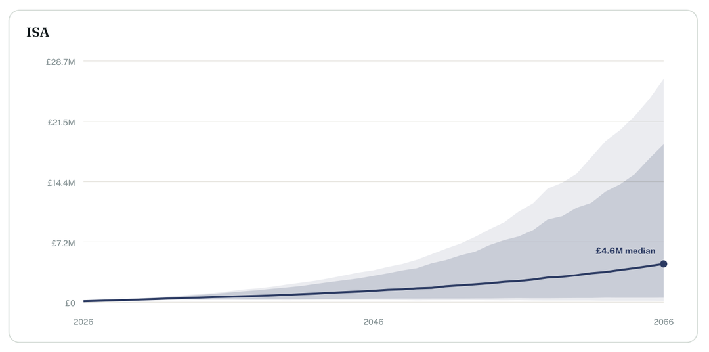

# claude_fire

*Financial Independence, Retire Early — modelled by an actual Monte Carlo
engine, driven by talking to it.*

## Why this exists

Retirement calculators mostly come in two flavours: a spreadsheet that
assumes 7% a year forever and calls it a plan, or a black box that takes your
numbers and hands back a probability with no way to ask why, or to see what
changes if you retire six months later, skip a holiday, or the market falls
the week you stop working.

`claude_fire` is neither. It's a real cashflow and Monte Carlo engine —
historical market returns back to 1928, UK income/NI/inheritance tax,
per-person mortality, care costs — wired up to a set of [Claude
Code](https://claude.com/claude-code) skills that turn a conversation about
your finances into a running model of them.

**Tax and estate rules are UK-specific today** (`tax/uk.py`, `tax/iht.py`) —
income tax, NI, State Pension, the pension IHT change coming in April 2027.
The cashflow, mortality and Monte Carlo machinery underneath none of that is
UK-specific, so another jurisdiction is a new `tax` module and a rewrite of
the tax-facing skills, not a different engine.

## An example

You, in Claude Code, inside this repo:

> I'm 52, my partner's 50. About £900k across pensions and ISAs, a paid-off
> house worth £480k. We'd like to retire as soon as we can without wrecking
> the numbers — when's that?

Claude Code — using the skills in `.claude/skills/` — asks a few clarifying
questions, turns your answers into a household definition, runs a handful of
scenarios (retire now, in two years, in four — each 2,000 times against a
different draw of market history) and comes back with something like:

> Retiring now clears 55% of simulated outcomes — most of the failures come
> from the first five years, before either pension unlocks. Waiting until
> July 2030 clears 98%, and costs less in lifestyle than you'd think.

And then it keeps going, because it's a conversation, not a form submission:

> What if we downsize instead of waiting?
> What if the market drops 30% the year we retire?
> Show me what happens if we leave more to the kids and spend less ourselves.

Each of those is a new scenario, run for real against thousands of simulated
years — not guessed at, not interpolated from the first answer.

## What it produces

The end product is an eight-section PDF: current position, the scenarios
tested and why, results, a detailed breakdown of the recommended plan, tax
and estate recommendations, structuring, a timeline, and notes on every
assumption made along the way. A few pages from the sample report, generated
from the fabricated household in `workspace/sample_client/`:

<p align="center"></p>

<p align="center"></p>

<p align="center"></p>

Nobody's real numbers — see [Workspace](#workspace) to generate your own.

## Requires Claude Code

There's no server and no hosted app. `retireplan` (the `src/retireplan/`
package) is a normal, dependency-free Python engine you can import and script
directly — see the snippet below. But the point of this repo is
`.claude/agents/` and `.claude/skills/`: instructions that teach Claude Code
how to gather your numbers, design scenarios, run the engine, sanity-check
the output against a fixed checklist, and write the report — so the actual
interface to a fairly serious piece of financial modelling is just talking to
it, in this repo, with Claude Code running.

**[Running a plan](#running-a-plan) below is the step-by-step.** The rest of
this section is for scripting the engine directly.

```python
from datetime import date
from retireplan import Household, Scenario, GuytonKlinger, run_monte_carlo

result = run_monte_carlo(
    household, Scenario("retire at 60", retirement_dates={"Alex": date(2030, 6, 1)},
                        withdrawal=GuytonKlinger()),
    as_of=date.today(), n_trials=2000, seed=42,
)
print(f"{result.success_probability:.1%} over {result.sample_years} years of history")
```

`run_many(household, scenarios, as_of, ...)` takes a dict of them and runs it
across processes — a sweep of a few dozen dates is a minute rather than twenty.

Everything works in **real (today's money) terms**: every figure in and out
is purchasing power, not future pounds.

## Install

Needs **Node 18+** (for Claude Code) and **Python 3.10 or newer**.

There are three things only you can do. Everything after them is ordinary
setup that Claude Code will do for you, and will redo if it ever breaks.

**1. Install Claude Code.** It is the interface to all of this, not an optional
extra — see [Requires Claude Code](#requires-claude-code) above.

```bash
npm install -g @anthropic-ai/claude-code
```

**2. Clone the repo and go into it.** Everything happens from the repo root:
the agents and skills live in `.claude/` here, and Claude Code will not find
them from anywhere else.

```bash
git clone https://github.com/SimonHaynes/claude_fire.git
cd claude_fire
```

**3. Get a free FRED API key** —
[fredaccount.stlouisfed.org/apikeys](https://fredaccount.stlouisfed.org/apikeys),
instant, no approval wait. You have to do this one yourself; nothing can sign
up on your behalf.

**4. Run `claude` and ask it to finish the setup.**

```bash
claude
```

> set this repo up: create the venv, install the package, and build the market
> and mortality data. My FRED key is <paste it here>

It creates `.env`, builds the virtualenv, installs `.[report,dev]`, fetches the
data and runs the tests — and if a step fails, it can read the error and fix
it, which is the reason to hand it the job rather than work through the
commands below.

<details>
<summary>Doing it by hand instead</summary>

```bash
cp .env.example .env                                  # add FRED_API_KEY=...
python -m venv .venv                                  # .venv\Scripts\ on native Windows
.venv/bin/pip install -e ".[report,dev]"
.venv/bin/python tools/fetch_market_data.py
.venv/bin/python tools/build_mortality_csv.py --fetch
.venv/bin/python -m pytest                            # ~500 tests, a few seconds
```

`report` adds jinja2, weasyprint and pymupdf — for building the PDF and for
rendering it back to images to proofread. `dev` adds pytest. The engine itself
is dependency-free.

</details>

**Why the key is needed.** The market and mortality data is **not checked into
this repo** — the sources' redistribution terms are unclear, so you rebuild it
locally (see [Data](#data) and `DATA_SETUP.md`). FRED supplies the US CPI used
to deflate every series to real terms, and the NBER recession series that
drives the corporate credit model. Without it, `fetch_market_data.py` stops and
no simulation will run: the default `global_equity` and `gov_bonds` series come
from those files. The only keyless dataset is the GDP-weighted global panel,
which is a deliberate opt-in for a specific question rather than a substitute
(`tools/fetch_global_market_data.py`, and `standard-assumptions` on when it is
the right call).

## Running a plan

With [Install](#install) done, everything from here happens through Claude
Code.

**1. Put your numbers in a text file.** Anywhere under `workspace/` — say
`workspace/smith.txt`. Your own files there are gitignored (everything except
the fabricated `sample_client/`), so real figures never reach a commit. Plain
notes are fine; it does not need structure, and it is better to paste a messy
list than to tidy it into something lossy:

```text
Family:
Alex (me), born 3/4/1972.  Jo (wife), born 19/9/1974.  Two kids at uni.

Alex:  salary £95K.  Pension: employee £1,200/mo, employer £400/mo (sal sac)
Jo:    salary £38K.  Pension: employee £450/mo, employer £250/mo (sal sac)

Outgoings (monthly):
Mortgage £1,850, £94,000 left, last payment 1/8/2031
Car loan £310, £9,400 left, last payment 1/3/2029
Council tax + utilities ~£550.  Everything else ~£2,900
Supporting each kid £550/mo while at uni, until 6/2028 and 6/2030

In retirement (monthly): utilities ~£550, essentials ~£1,900, discretionary £900
Plus yearly: £8,000 house/car replacement, £7,000 holiday (while we're young enough)

Assets:
House ~£520K jointly owned
Alex:  workplace pension £610,000 (global tracker), SIPP £140,000, ISA £88,000
Jo:    pension £96,000 (global tracker), ISA £41,000
       DB pension £7,100/yr from 60 plus £14,000 lump sum
Both have full NI records.

Goals:
* Retire as early as possible — my notice period is 3 months
* Help both kids with house deposits
* Leave whatever's left to each other, then the kids

Notes:
* Happy to take risk.  Would cut spending if things went badly, to a point.
* Resident in England
```

Include the goals and the constraints, not just the balances. "As early as
possible, notice period is three months" and "we'd cut back if we had to" are
what turn one answer into a set of alternatives worth comparing.

**2. Run `claude` from the repo root and ask for a plan.**

> run a FIRE plan on the information in workspace/smith.txt

**3. Answer the handful of questions it asks.** It fills every gap it can from
published standards and tells you which — but a few things have no defensible
default and it will stop and ask: whether to use national-average longevity or
rate it for an affluent household, how far you would really cut spending in a
downturn, and what to do with any goal you named but never costed. Each one
changes the answer materially.

**4. Expect it to take about half an hour**, most of it simulation. It works
through `.claude/agents/retirement-planner.md`, which runs the chain in order —
`intake-financial-data` to build the household, `define-scenarios` to turn your
goals into scenarios, `run-scenario-simulation` to run them,
`build-retirement-report` for the PDF — delegating tax and legal reasoning to
two further agents on the way. You do not need to read any of it; it is there
if you want to see the reasoning being followed.

You end up with `workspace/smith/` containing the household definition, the
scenarios, and `report.pdf`.

**5. Then keep going, because it is a conversation and not a form:**

> what if we downsize to something £150k cheaper instead of waiting?
>
> show me what happens if markets drop 30% the year we stop
>
> we'd rather spend it than leave it — what does that change?

Each is a new scenario, run for real against thousands of simulated paths.

## Workspace

Household definitions live outside the package, under `workspace/` — they
are data about real people, not library code. `workspace/sample_client/` is
a fabricated fixture used by the tests and this README; everything else
under `workspace/` is gitignored, since real financial data should never be
committed.

To set a household up by hand instead:

```bash
mkdir workspace/<name>
touch workspace/<name>/__init__.py
# write household.py, scenarios.py, run_scenarios.py, build_report.py
# — workspace/sample_client/ is the pattern to copy.
.venv/bin/python -m workspace.<name>.run_scenarios   # compare every scenario
.venv/bin/python -m workspace.<name>.build_report    # PDF report
```

## Layout

| Module | Responsibility |
|---|---|
| `model`, `serde` | what a household is; JSON round-tripping |
| `tax` | jurisdiction rules behind one interface (UK 2025/26 supplied) |
| `market` | historical data, return models, block-bootstrap sampler |
| `plan` | compiles household + scenario into a fixed year-by-year schedule |
| `cashflow` | runs one path of returns through that schedule |
| `simulation` | runs thousands; disk-cached results |
| `strategies` | withdrawal / drawdown / allocation, independently composable |
| `reporting` | charts and the PDF report |

`plan` exists for speed and clarity: everything market-independent (dates,
income, tax bands, expenses, debt schedules) is computed once rather than
re-derived on every trial.

## Strategies

Three independent axes, freely combinable. Varying one at a time is how you
find out which is doing the work — and, often, which is doing nothing.

**Withdrawal — how much to spend.** Two families answering different
questions. *Needs-based* rules start from the spending plan and cut only when
they must (`SpendNominal`, `PostAccessStepUp`);
*portfolio-based* rules derive spending from what the portfolio is currently
worth (`PercentOfPortfolio`, `VariablePercentage`). `GuytonKlinger` sits
between them. Portfolio rules essentially cannot run out of money — they spend
a fraction of whatever remains — so they convert failure risk into income
volatility. Compare them on spend percentiles, not success probability alone.

**Drawdown — which pots to sell.** `StandardOrder` (cash → ISA → pension),
`CashBondLadder` (a pre-funded safe bucket), `TaxEfficientOrder` (fill cheap
tax bands from the pension deliberately and bank the surplus in an ISA).

**Allocation — what each asset earns.** `StaticMix`, `ByAssetTypeMix`,
`GlidePath`.

## Tax

`tax/uk.py` covers income tax (as an effective marginal-rate schedule, so the
£100k allowance taper falls out naturally), NI, State Pension, pension access
age, and the tax-free lump sum with its Lump Sum Allowance cap.

`tax/iht.py` covers Inheritance Tax including **unused pensions entering the
estate from 6 April 2027** — which inverts the long-standing advice to spend
ISAs first and leave the pension for the heirs. Every result carries both
`bequest_percentiles` (gross) and `net_bequest_percentiles` (after IHT and
beneficiaries' income tax on inherited pension funds).

**Quote the net figure.** For a pension-heavy estate the gross number can
overstate what reaches the children by more than half. Expect a good tax
strategy to produce a *smaller* estate and a *larger* inheritance.

## Return models

The choice that most often flatters a plan:

| Model | For |
|---|---|
| `SampledSeries("global_equity")` | trackers and funds — draws from history |
| `FixedNominal(0.07)` | anything quoted as a headline yield |
| `HeldToMaturityCredit(0.07)` | bonds bought at a yield and held to maturity |
| `FixedReal(0.02)` | where a real return is genuinely intended |
| `Blend.of(global_equity=0.6, gov_bonds=0.4)` | a fixed mix |
| `ParametricNormal(mean=0.052, stdev=0.19)` | Monte Carlo from a distribution, not history |

`HeldToMaturityCredit` models the instrument rather than a bond fund: held to
maturity there is no mark-to-market risk (it redeems at par), so the risk is
**default**. Defaults are driven off the NBER recession series, because they
cluster in exactly the years equities fall and a retiree is selling to eat —
treating them as independent puts the losses in the wrong years. Recoveries
worsen in the same years, and `n_holdings` makes losses lumpy for a
concentrated ladder. Defaults are calibrated to Moody's long-run
speculative-grade statistics (4.5% through the cycle, ~10% in a recession).

A quoted 6–8% is a **nominal** coupon. Modelling it as a real return grants an
inflation-proof yield that no product offers, and hides the risk that actually
threatens fixed-income holdings: a 1970s-style decade.

`ParametricNormal` is the other family entirely: an independent Normal draw
every year, no sequence that ever actually happened, no autocorrelation or
mean reversion. `BlockBootstrap`-sampled history (the default) is what
FIRECalc and cFIREsim both do and what this engine defaults to; this is the
parametric alternative the same tools offer alongside it — for a household
using capital market assumptions instead of a resampled historical panel, or
wanting a global equity assumption without the survivorship bias inherent in
any panel of markets that happened to keep functioning continuously (see
`tools/fetch_global_market_data.py` and REVIEW.md sec.6 for that bias,
measured, not guessed at — the 5.2%/1.7% real figures above are the UBS
Global Investment Returns Yearbook's own published equity/bond means). Never
silently swap one family for the other: they answer different questions and
the choice should be attributable in the same way every other assumption in
this engine is.

## Sampling windows

Different series cover different periods. `MarketData.window` returns only
years where *every* series a scenario needs is present, and every result
carries `sample_years` / `sample_first_year` / `sample_last_year`.

This matters more than it sounds. Short-dated corporate bond data starts in
2008; using it narrows the bootstrap from 98 years to 18, and those 18 contain
no crash on the scale of 1929 or 1973-74. Plans then score ~100% — a statement
about the sample, not the plan. **Report the window wherever you report a
probability**, and treat any 0% or 100% as a red flag rather than a result.

## Data

`src/retireplan/data/` holds real annual returns and a mortality table, each
with a full provenance header once fetched. Read them before trusting a
number. **The CSVs are gitignored, not committed** — third-party market data
redistribution terms are unclear enough that this repo ships none of it.
Instead:

```bash
.venv/bin/python tools/fetch_market_data.py            # equity, bond, recession, corporate
.venv/bin/python tools/build_mortality_csv.py --fetch   # mortality
```

See [`DATA_SETUP.md`](DATA_SETUP.md) for exactly what each script fetches and
from where — including what to do if the ONS page's layout ever changes
under `--fetch` and it needs a manually-downloaded workbook instead. In
outline:

- `us_long_*.csv` — S&P 500 and 10-year Treasury total returns (NYU Stern /
  Damodaran) deflated by US CPI. A US proxy for a global portfolio.
- `us_short_corporate_*.csv` — short-dated corporate credit, from IGSB
  adjusted closes (Yahoo Finance). A documented proxy for a WiseAlpha-style
  holding; the file states the gaps (investment grade vs sub-IG, USD vs
  sterling, diversified vs concentrated).
- `us_recession_*.csv` — fraction of each year spent in an NBER-dated
  recession (FRED `USREC`), which drives credit default incidence.
- `mortality/ons_qx_ew_*.csv` — ONS national life tables, England & Wales.

`fetch_market_data.py` needs a free FRED API key (see `.env.example`); the
Damodaran and Yahoo Finance sources need no key. The fetched numbers should
match the originals to within data-revision noise — the header each script
writes documents the exact source and method, so a mismatch is diagnosable.

## Mortality, survivorship and care

Deaths are modelled per person, not as one shared horizon. On a first death the
survivor loses a personal allowance and a State Pension outright, keeps part of
the deceased's DB pension, inherits their pots, and sees spending fall by
category rather than by half. IHT settles on the second death.

Age at death is either fixed (`FixedAge`, the default, reproducing older
results) or sampled per trial from ONS life tables (`LifeTable`). Sampling
matters more than it sounds: on the sample household it cut the median net
bequest by 31%, because a fixed age 95 was quoting a tail as a median, and it
*lowered* success, because a fixed age hides the trials where someone lives
past 100.

`Scenario.care` adds late-life residential care, off by default and
deliberately without a probability attached.

`Assumptions.fiscal_drag` erodes tax thresholds frozen in nominal terms.
Defaults to off, because turning it on should be attributable.

## Not modelled

Annual gift exemptions and gifts from surplus income, advice fees and
transaction costs, cross-spouse tax levelling, currency effects, and a search
for the worst historical retirement start. Life tables are period rather than
cohort, which understates longevity by a couple of years.

**The remaining omissions are, on balance, still optimistic** — see REVIEW.md
for the full list and priorities.

**This is a modelling tool, not regulated financial advice.**
